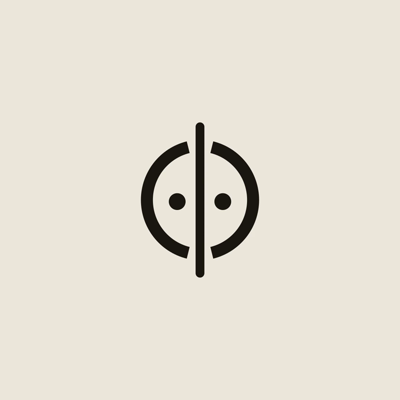
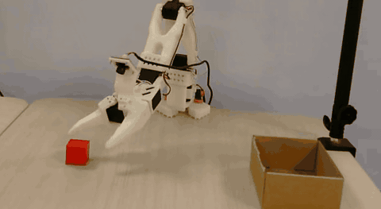

<div align="center">



# Φ — Physical Hardware Intelligence

**An open, reproducible robot-learning pipeline — hardware to trained policy, documented end to end.**

[](LICENSE)
[](https://github.com/huggingface/lerobot)
[](https://github.com/TheRobotStudio/SO-ARM100)
[](docs/00-overview.md)



<sub>Our SO-101, front camera, from <a href="datasets/phi_so101_cubes_cylinder_v1.md"><code>phi_so101_cubes_cylinder_v1</code></a> — real recorded data, not a render.</sub>

</div>

---

## What this is

The robotics SIG at **Northeastern University, Silicon Valley**. Everything we build — robots, datasets, policies, training runs, evaluations — lives in this one repo, versioned and documented so a new member can get to a trained policy **without starting from scratch**.

We don't reinvent the engine. [LeRobot](https://github.com/huggingface/lerobot) does the driving; Φ adds the **curriculum, curation, evaluation protocol, and reproducibility** layer on top.

## Quickstart

```bash
git clone https://github.com/physical-hardware-intelligence/phi.git && cd phi
conda env create -f env/environment.mac.yml   # or environment.cuda.yml on a GPU box
conda activate phi
pip install -e .
cp configs/ports.local.sh.example configs/ports.local.sh   # then put your ports in it
make help
```

**New here? Read [`docs/00-setup-your-laptop.md`](docs/00-setup-your-laptop.md) instead** — it
covers prerequisites, what each package is for, how to verify the install actually worked, and
the failure modes that are silent if you skip the check.

For the shape of the whole project: **[`docs/00-overview.md`](docs/00-overview.md)**.

## Where do I go?

| I want to… | Go here |
|---|---|
| **Set up your laptop** | [Setup your laptop](docs/00-setup-your-laptop.md) |
| **Understand the whole thing** | [Overview](docs/00-overview.md) |
| **Build or buy the arm** | [Hardware & build](docs/robots/so-arm101/01-hardware.md) |
| **Get an arm running** | [Setup & bring-up](docs/robots/so-arm101/02-setup.md) |
| **Record a dataset** | [Teleop & data](docs/robots/so-arm101/03-teleop-and-data.md) |
| **Train a policy** | [Training — the policy zoo](docs/training/README.md) |
| **Score a policy honestly** | [Evaluation protocol](docs/evaluation/README.md) |
| **Run a trained policy on the arm** | [Deployment — inference](docs/deployment/README.md#1-on-robot--run-a-policy-from-your-terminal) |
| **Train on the cluster** | [Explorer HPC](docs/hpc/explorer.md) |
| **Do kinematics in sim** | [Simulation (MuJoCo)](simulation/README.md) |
| **Know *why* a policy works** | [Theory notes](docs/theory/README.md) |
| **Something is broken** | [Troubleshooting](docs/robots/so-arm101/troubleshooting.md) |
| **Contribute** | [CONTRIBUTING](CONTRIBUTING.md) |

## The member ladder

| Level | You can… | Start here |
|---|---|---|
| **L0** Onboard | replay a recorded episode | [overview](docs/00-overview.md) |
| **L1** Operator | calibrate, teleoperate, record a dataset | [02-setup](docs/robots/so-arm101/02-setup.md) |
| **L2** Trainer | train a policy on your data and score it | [training](docs/training/README.md) · [evaluation](docs/evaluation/README.md) |
| **L3** Contributor | add a task or config, close a good-first-issue | [tasks/TEMPLATE](tasks/TEMPLATE.md) |
| **L4** Researcher | run a new experiment and write it up | [experiments/TEMPLATE](experiments/TEMPLATE.md) |
| **L5** Maintainer | own a module, review PRs | [CONTRIBUTING](CONTRIBUTING.md) |

## What's in here

```
docs/          the curriculum (mkdocs site)
simulation/    MuJoCo + SO-101 kinematics — runs on a Mac
src/phi/       thin tooling over LeRobot
configs/       pinned, seeded run configs
datasets/      dataset cards — data lives on the HF Hub
models/        model cards, one per checkpoint
experiments/   dated write-ups of every run
tasks/         task specs + eval rubrics
env/ tests/    environments · unit + smoke tests
```

## Status

**Phase 1 — training and evaluating on our own arm.**

| | |
|---|---|
| Datasets recorded | **3** public on the HF Hub, 3-camera (wrist · front · top) |
| Policies trained | **ACT**, **Diffusion Policy** (CNN + Transformer), patch-encoder variants |
| Model cards | **6** |
| Experiment write-ups | **9** |
| Rollouts scored on the real arm | **62**, against a written rubric |
| Simulation | MuJoCo FK/IK on the SO-101, verified against the model |

Cockpit is a Mac (record + teleop); training runs on a CUDA box or the Explorer cluster.

> **We publish negative results.** Several experiments here record things that did not work, and one carries a correction notice over its original conclusion. That is deliberate — see [`experiments/`](experiments/).

## License & credits

Apache-2.0 — see [LICENSE](LICENSE). Built on [LeRobot](https://github.com/huggingface/lerobot) and the [SO-ARM100/101](https://github.com/TheRobotStudio/SO-ARM100) hardware project.

Φ is a Student Interest Group at Northeastern University, Silicon Valley. Not affiliated with or branded by the university.
